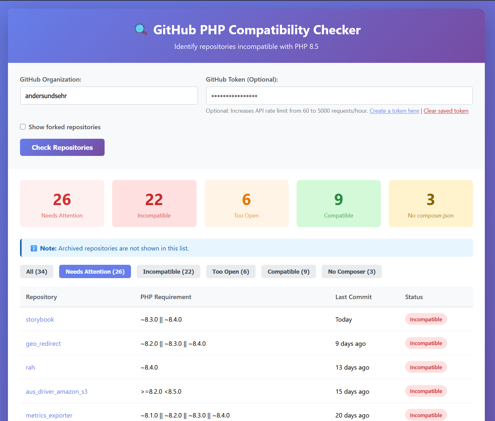

# GitHub PHP Compatibility Checker

A web-based tool to check your GitHub organization's repositories for PHP version compatibility.



## What does it do?

This tool scans all repositories in a GitHub organization and identifies which ones are not compatible with the latest stable PHP version.

**Features:**
- Automatically fetches the latest stable PHP version from php.net
- Scans all repositories in your GitHub organization
- Analyzes `composer.json` files to determine PHP version requirements
- Displays a clear overview of compatible and incompatible repositories
- Optional GitHub token support for higher API rate limits
- Toggle to include/exclude forked repositories

The tool uses semantic versioning to compare the required PHP versions in your repositories against the latest stable release, helping you identify which projects need updates.

## Deployment Options

You can run this application in several ways:
- **Docker** (Recommended for production): Using the pre-built image or building from source
- **DDEV** (Recommended for development): Local development environment
- **Manual Setup**: Using PHP's built-in server

## Docker Deployment

### Quick Start with Pre-built Image

The easiest way to run this application is using the pre-built Docker image:

```bash
# Pull and run the image
docker run -d -p 8080:80 --name php-compat-checker andersundsehr/github-php-compatibility-checker

# Open in browser
open http://localhost:8080
```

### Using Docker Compose

Create a `docker-compose.yml` file:

```yaml
services:
  app:
    image: andersundsehr/github-php-compatibility-checker
    container_name: github-php-compatibility-checker
    ports:
      - "8080:80"
    restart: unless-stopped
```

Then run:

```bash
docker compose up -d
```

### Building from Source

If you want to build the Docker image yourself:

```bash
# Build the image
docker build -t github-php-compatibility-checker .

# Run the container
docker run -d -p 8080:80 --name php-compat-checker github-php-compatibility-checker

# Or use docker-compose
docker compose up -d
```

**Docker Requirements:**
- Docker Engine 20.10+
- Docker Compose v2+ (optional)

## Getting Started with DDEV

This project includes a complete DDEV configuration, making it easy to get started.

### Prerequisites

- [DDEV](https://ddev.readthedocs.io/en/stable/#installation) installed on your system
- Docker

### Setup

```bash
# Clone the repository
git clone https://github.com/andersundsehr/github-php-compatibility-checker.git
cd github-php-compatibility-checker

# Start DDEV
ddev start

# Install dependencies
ddev composer install

# Open in browser
ddev launch
```

The application will be available at `https://compatiblity-check.ddev.site`

## Usage

1. **Enter Organization Name**: Type the GitHub organization name you want to check (e.g., `andersundsehr`)

2. **GitHub Token (Optional)**:
    - Without a token, you're limited to 60 API requests per hour
    - With a token, you get 5,000 requests per hour
    - Create a token at [GitHub Settings → Developer settings → Personal access tokens](https://github.com/settings/tokens)
    - Required scopes: `public_repo` or `repo` (read-only access)
    - The token will be saved in a cookie for convenience

3. **Include Forks**: Toggle whether to include forked repositories in the scan

4. **View Results**: The tool displays:
    - Current latest PHP version
    - List of all repositories with their PHP requirements
    - Compatibility status (✅ compatible, ❌ incompatible, ⚠️ unknown)
    - Direct links to repositories and their composer.json files

## Development

### Running Tests

```bash
ddev exec phpunit
```

### Composer Commands

```bash
ddev composer <command>
```

### Project Structure

```
public/          # Web root with index.php
src/             # Source code
  UtilityFunctions.php  # Core functionality
tests/           # PHPUnit tests
.ddev/           # DDEV configuration
```

## Manual Setup (Without Docker/DDEV)

If you prefer not to use Docker or DDEV:

```bash
# Install dependencies
composer install

# Start PHP built-in server
php -S localhost:8000 -t public/

# Open in browser
open http://localhost:8000
```

**Requirements:**
- PHP 8.3 or higher
- Composer
- cURL extension enabled

## Technical Details

- **PHP Version**: 8.3
- **Web Server**: nginx-fpm (DDEV) or any PHP-compatible server
- **Dependencies**:
    - `composer/semver` for version comparison
    - `phpunit/phpunit` for testing
- **API Integration**: GitHub REST API v3

## License

This project is licensed under the terms specified in the LICENSE file.

# with ♥️ from anders und sehr GmbH

> If something did not work 😮  
> or you appreciate this Project 🥰 let us know.

> We are hiring https://www.andersundsehr.com/karriere/
